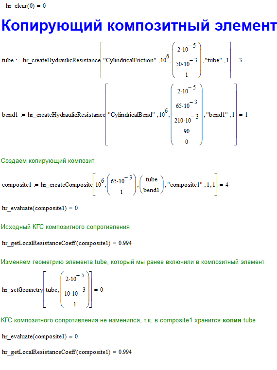

# Mathcad API

Mathcad API предназначен для подключения бибилиотеки гидравлических сопротивлений в Mathcad.

## Установка

Для установки бибилиотеки гидравлических сопротивлений в Mathcad необходимо поместить модуль libhydrocalcmcad.dll в директорию для пользовательских функций (По умолчанию `c:\Program Files (x86)\Mathcad\Mathcad 15\userefi\`). При запуске mathcad автоматически загрузит все модули, находящиеся в этой директории.

## Пример использования

В представленном ниже [примере](./examples/create_hr.xmcd) производится расчет гидравлического сопротивления круглой трубы с шероховатостью 2e-5 м, диаметром 50 мм и длиной 1 м.

**Обратите внимание**, в начале рабочей области используется функция `hr_clear()`. Поскольку бибилиотека гидравлических сопротивлений имеет объектовую архитектуру, при вызове методов для создания гидравлических сопротивлений `hr_createHydraulicResistance` или `hr_createComposite` (методы-конструкторы) в памяти компьютера создается объект, который сохраняется до завершения работы mathcad. При нажатии `Ctrl+F9` все функции рабочей области вызываются заново, что приводит к тому, что в памяти остаются старые объекты и загружаются новые. Чтобы многократный пересчет рабочей области не расходовал память компьютера, перед созданием объектов вызывается метод `hr_clear()`, который производит очистку памяти от созданных ранее гидравлических сопротивлений.

## Описание функций и методов

### Конструкторы гидравлических сопротивлений

Возвращаемое значение функций-конструкторов - целочисленный индекс элемента в памяти компьютера.

#### `hr_createHydraulicResistance(resistance, Re, G, name, viscosity)`

Создает заданное гидравлическое сопротивление.
**Аргументы**
  - **resistance**: Тип гидравлического сопротивления, принимает одно из следующих значений
    - `"CylindricalFriction"` - трение в круглом канале
    - `"RingFriction"` - трение в кольцевом канале
    - `"SharpUnexpectedSizeChange"` - внезапное изменение сечение канала
    - `"CylindricalBend"` - колено/отвод круглого сечения
    - `"CylindricalBendNiche"` - колено круглого сечения с нишей
    - `"CylindricalConfuserCurve"` - круглый конфузор с криволинейной образующей
    - `"CylindricalConfuserStraight"` - круглый конфузор с прямолинейной образующей
    - `"CylindricalDiffuserCurve"` - круглый диффузор с криволинейной образующей
    - `"CylindricalDiffuserStraight"` - круглый диффузор с прямолинейной образующей
    - `"HydraulicResistanceDefined"` - заданный коэффициент гидравлического сопротивления
  - **Re**: Число Рейнольдса. Положительное значение числа рейнольдса соответсвтует прямому направлению потока через элемент, отрицательное - обратному. При этом некоторые элементы имеют различное сопротивление для прямого и обратного направлений. Например, при отрицательном числе Рейнольдса для диффузора, его гидравлическое сопротивление будет рассчитываться по диаграммам для конфузора.
  - **G**: Вектор геометрических характеристик гидравлического сопротивления. Его размер и значение элементов зависят от конкретного типа гидравлического сопротивления. Подробнее о геометрических характеристиках элементов см. [описание геометрических характеристик элементов](./doc/geometry_vector.md).
  - **name**: Имя гидравлического сопротивления
  - **viscosity**: Кинематическая вязкость потока в гидравлическом сопротивлении. При расчете гидравлического сопротивления композитных элементов соотношение кинематических вязкостей композита и его составляющих используется для определения эквивалентного числа Рейнольдса каждого элемента в случае наличия в них разных температур.

[Пример](./examples/create_hr.xmcd) использования конструктора гидравлических сопротивлений.

#### `hr_createComposite(Re, G, elements, name, viscosity, unique)`

Создает композитное гидравлическое сопротивление, включающее в себя другие гидравлические сопротивления (в том числе и другие композитные элементы).

[Пример](./examples/create_composite.xmcd) создания композитных гидравлических сопротивлений.
[Пример](./examples/create_nested_composite.xmcd) создания вложенных композитных сопротивлений.

Расчет композитного элемента производится в предположении, что массовый расход через элемент постоянен: $ G = const $. Обозначим через индекс 1 все величины, относящиеся к композитному элементу (приведенные параметры), а через индекс 2 - все величины относящиеся к элементу в составе композита. Поскольку массовый расход через все элементы композита одинаков
$$ G_1 = G_2 = w_1 A_1 \rho_1 = w_2 A_2 \rho_2 $$
откуда
$$ \frac{w_1}{w_2} = \frac{A_2 \rho_2}{A_1 \rho_1} \quad \text{(1)} $$
Числа Рейнольдса элементов
$$ Re_1 = \frac{w_1 {D_1}^Г}{\nu_1}, Re_2 = \frac{w_2 {D_2}^Г}{\nu_2} $$
откуда
$$ \frac{Re_1}{Re_2} = \frac{w_1}{w_2} \cdot \frac{{D_1}^Г}{{D_2}^Г} \cdot \frac{\nu_2}{\nu_1} \quad \text{(2)} $$
Подставляя (1) в (2), получаем
$$ \frac{Re_1}{Re_2} = \frac{A_2}{A_1} \cdot \frac{{D_1}^Г}{{D_2}^Г} \cdot \frac{\nu_2 \rho_2}{\nu_1 \rho_1} $$
или
$$ \frac{Re_1}{Re_2} = \frac{A_2}{A_1} \cdot \frac{{D_1}^Г}{{D_2}^Г} \cdot \frac{\mu_2}{\mu_1} \quad \text{(3)} $$

В представленных формулах

$w$ - скорость потока, м/с

$A$ - площадь проходного сечения, м2

$D^Г$ - гидравлический диаметр, м

$\rho$ - плотность потока, кг/м3

$\nu$ - динамическая вязкость потока, м2/с

$\mu$ - кинематическая вязкость потока, Па*с

Таким образом, при установлении числа Рейнольдса для всего композитного элменета, для каждого из элементов внутри композита устанавливается свое число Рейнольдсо. такое, чтобы выполнялся закон сохранения массы.

При расчете суммарного коэффициента гидравлического сопротивления композитного элемента, сопротивления его составляющих приводятся к гидравлическому диаметру композита и суммируются:
$$ \xi = \displaystyle\sum_{i=1}^{N} \xi_i \left(\frac{{D_1}^Г}{{D_i}^Г}\right)^4 \quad \text{(4)} $$

**Аргументы**
  - **Re**: Число Рейнольдса. Положительное значение числа рейнольдса соответсвтует прямому направлению потока через элемент, отрицательное - обратному. При этом некоторые элементы имеют различное сопротивление для прямого и обратного направлений. Например, при отрицательном числе Рейнольдса для диффузора, его гидравлическое сопротивление будет рассчитываться по диаграммам для конфузора.
  - **G**: Вектор геометрических характеристик композитного сопротивления. Подробнее о геометрических характеристиках элементов см. [описание геометрических характеристик элементов](./doc/geometry_vector.md).
  - **name**: Имя гидравлического сопротивления
  - **viscosity**: Эквивалентная кинематическая вязкость потока в композитном элементе
  - **unique**: Флаг, указывающий, будет ли композит хранить копии гидравлических элементов, или только указатели на них. Если композитный элемент хранит копии гидравлических элементов, то при изменении исходного гидравлического сопротивления, сопротивление в композите не поменяется

  Рассмотрим [пример](./examples/copy_composite.xmcd) копирующего композита

  

  Поскольку аргумент `unique` = 1, конструктор `hr_createComposite` создает копирующий композитный объект, который сохряняет в себе копии гидравлических элементов. Таким образом, при изменении геометрии исходного элемента не происходит изменения сопротивления композита, поскольку в `composite1` хранится независимая копия элемента `tube`.

  Теперь рассмотрим [пример](./examples/pointer_composite.xmcd) указывающего композитного элемента.

  

  В этом примере конструктор `hr_createComposite` создает указывающий композитный объект, т.к. аргумент `unique` = 0. Такой композит не создает копий, а лишь указывают на существующие гидравлические сопротивлений. Соответственно, изменение геометрии исходного элемента `tube` оказывает влияние на сопротивление композитного объекта `composite1`, который хранит в себе указатель на элемент `tube`.

### Методы композитных элементов

#### `hr_composite_erase(composite_id, element_id)`

Удаляет элемент из композита

 - **composite_id**: Id композитного элемента, из которого будет производиться удаление
 - **element_id**: Порядковый номер элемента в композите, который будет удален
 [Пример](./examples/composite_erase.xmcd) использования метода `hr_composite_erase`

 

 КГС `composite1` стал равен КГС `bend1`, т.к. после вызова метода `hr_composite_erase(composite1, 0)` из композита был удален первый находящийся в нем элемент (`tube`)

#### `hr_composite_get(composite_id, element_id)`

Возвращает Id элемента в композите по его порядковому номеру. Если композит копирующий, то метод создает копию внутреннего элемента композита и помещает ее в глобальную память.

 - **composite_id**: Id композитного элемента
 - **element_id**: Порядковый номер элемента в композите
[Пример](./examples/composite_get_getall.xmcd)

#### `hr_composite_getAll(composite_id)`

Возвращает Id всех элементов в композите. Если композит копирующий, то метод создает копии внутренних элемента композита и помещает их в глобальную память.

 - **composite_id**: Id композитного элемента
[Пример](./examples/composite_get_getall.xmcd)

#### `hr_composite_push_back(composite_id, element_id)`

Помещает элемент в композит
 - **composite_id**: Id композитного элемента
 - **element_id**: Id элемента, помещаемого в композит

#### `hr_composite_size(composite_id)`

Возвращает количество элементов в композите
 - **composite_id**: Id композитного элемента

### Общие методы

#### `hr_evaluate(element_id)`

Производит вычисление гидравлического элемента
 - **element_id**: Id элемента

#### `hr_delete(element_id)`

Удаляет гидравлический элемент из памяти
 - **element_id**: Id элемента

### Методы-геттеры

 Методы-геттеры позволяют получить значения текущих параметров гидравлического элемента

#### `hr_getCrossSectionArea(element_id)`

 Возвращает площадь проходного сечения элемента
 - **element_id**: Id элемента

#### `hr_getDiagram(element_id)`

 Возвращает номер диаграммы (или источник корреляций), по которым производился расчет гидравличсекого сопротивления
 - **element_id**: Id элемента

#### `hr_getFrictionPartCoeff(element_id)`

 Вовзвращает составляющую КГС, обусловленную трением в элементе
 - **element_id**: Id элемента

#### `hr_getGeometry(element_id)`

 Возвращает массив геометрических характеристик элемента. Подробнее о геометрических характеристиках элементов см. [описание геометрических характеристик элементов](./doc/geometry_vector.md).
 - **element_id**: Id элемента

#### `hr_getGeometryPartCoeff(element_id)`

 Возвращает составляющую КГС, обусловленную геометрическими характеристиками элемента
 - **element_id**: Id элемента

#### `hr_getHydraulicDiameter(element_id)`

 Возвращает гидравлический диаметр элемента
 - **element_id**: Id элемента

#### `hr_getId(element_id)`

Возвращает внутренний Id элемента (не используется)
 - **element_id**: Id элемента

#### `hr_getLength(element_id)`

Возвращает длину элемента
 - **element_id**: Id элемента

#### `hr_getLocalResistanceCoeff(element_id)`

 Возвращает КГС элемента (с учетом потерь на трение)
 - **element_id**: Id элемента

#### `hr_getName(element_id)`

 Возвращает имя элемента. Имя гидравлического элемента состоит из двух частей: базовая часть - собственное имя элемента, дополнительная часть - имя элемента, которому принадлежит данный элемент: `[дополнительная часть]{базовая часть}`. Например, элемент с собственным именем `"tube"`, включенный в композитный элемент с собственным именем `"composite"` будет иметь полное имя `"[composite]{tube}"`.
 - **element_id**: Id элемента

#### `hr_getRe(element_id)`

 Возвращает число Рейнольдса в элементе. Положительные значения числа рейнольдса соотвтетствует прямому направлению потока в элементе, в то время как отрицательные - обратному.
 - **element_id**: Id элемента

#### `hr_getRelFrictionCoeff(element_id)`

 Возвращает относительный коэффициент трения $\lambda$
 - **element_id**: Id элемента

#### `hr_getRou(element_id)`

 Возвращает шероховатость элемента
 - **element_id**: Id элемента

#### `hr_getType(element_id)`

 Возвращает тип элемента (см. [типы элементов для конструктора](#конструкторы-гидравлических-сопротивлений))
 - **element_id**: Id элемента

#### `hr_getViscosity(element_id)`

 Вовзращает кинематическую вязкость потока в элементе
 - **element_id**: Id элемента

### Методы-сеттеры

методы-сеттеры позволяют установить значения характеристик гидравлических элементов.

#### `hr_setGeometry(element_id, G)`

Устанавливает геометрические характеристики элемента. 
- **element_id**: Id элемента
- **G**: Вектор геометрических характеристик элемента. Подробнее о геометрических характеристиках элементов см. [описание геометрических характеристик элементов](./doc/geometry_vector.md).

#### `hr_setLength(element_id, L)`

Устанавливает длину элемента
- **element_id**: Id элемента
- **L**: Длина [м]

#### `hr_setName(element_id, name)`

Устанавливает собственное имя элемента. Подробнее об именовании элементов [см. `hr_getName`](#hr_getnameelement_id)
- **element_id**: Id элемента
- **name**: Новое собственное имя элемента

#### `hr_setRe(element_id, Re)`

Устанавливает число Рейнольдса для элемента. Подробнее о числе Рейнольдса для композитных элементов [см. `hr_createComposite`](#hr_createcompositere-g-elements-name-viscosity-unique)
- **element_id**: Id элемента
- **Re**: Число Рейнольдса. Положительные значения числа рейнольдса соотвтетствует прямому направлению потока в элементе, в то время как отрицательные - обратному.

#### `hr_setRou(element_id, rou)`

Устанавливает абсолютную шероховатость элемента
- **element_id**: Id элемента
- **rou**: Абсолютная шероховатость [м]

#### `hr_setViscosity(element_id, viscosity)`

Устанавливает кинематическую вязкость элемента. Подробнее о назначении кинематической вязкость в элементах [см. `hr_createComposite`](#hr_createcompositere-g-elements-name-viscosity-unique)
- **element_id**: Id элемента
- **viscosity**: Кинематическая вязкость потока [Па*с]
