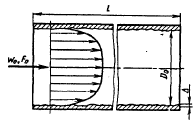
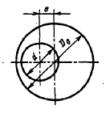
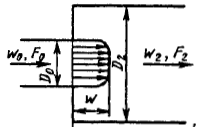
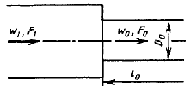
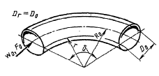
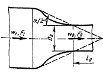
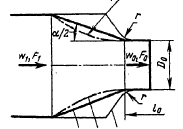
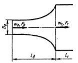
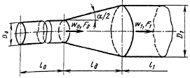

# Значения полей вектора геометрических характеристик для элементов различного типа

## Composite

Композитное гидравлическое сопротивление

- G[0]: Эквивалентный гидравлический диаметр (к нему приводится КГС) [м]
- G[1]: Эквивалентная длина элемента. Определяет инерционность потока в элементе (в данный момент не используется) [м]

## CylindricalFriction
 
Трение в круглом канале

 
 
- G[0]: Шероховатость [м]
- G[1]: Гидравлический диаметр [м]
- G[2]: Длина элемента [м]

## RingFriction
 
Трение в кольцевом канале

 
- G[0]: Шероховатость [м]
- G[1]: Внешний диаметр [м]
- G[2]: Внутренний диаметр [м]
- G[3]: Эксцентриситет [м]
- G[4]: Длина элемента [м]
 
## SharpUnexpectedSizeChange
 
Внезапное изменение сечение канала

 
- G[0]: Шероховатость [м]
- G[1]: Диаметр 1 (по потоку) [м]
- G[2]: Диаметр 2 (по потоку) [м]
 
## CylindricalBend
 
Колено/отвод круглого сечения

 
- G[0]: Шероховатость [м]
- G[1]: Гидравлический диаметр [м]
- G[2]: Радиус гиба [м]
- G[3]: Угол поворота [град]; в случае, когда G[3] < 0, угол поворота вычисляется как 360 - G[3]
- G[4]: Длина прямого участка перед коленом [м]; G[4] = 0 означает, что колено располагается сразу за коллектором (большим объемом), в то время как G[4] > 0 означает, что прямая секция длиной L = G[4] расположена до входа в колено.
 
## CylindricalBendNiche
 
Колено круглого сечения с нишей
 
- G[0]: Шероховатость [м]
- G[1]: Гидравлический диаметр [м]
- G[2]: Радиус гиба [м]
- G[3]: Угол поворота [град]; в случае, когда G[3] < 0, угол поворота вычисляется как 360 - G[3]
- G[4]: Длина прямого участка перед коленом [м]; G[4] = 0 означает, что колено располагается сразу за коллектором (большим объемом), в то время как G[4] > 0 означает, что прямая секция длиной L = G[4] расположена до входа в колено.
 
## CylindricalConfuserCurve
 
Круглый конфузор с криволинейной образующей

 
- G[0]: Шероховатость [м]
- G[1]: Гидравлический диаметр конфузора [м]
- G[2]: Длина прямой секции за конфузором [м]
- G[3]: Длина конфузора [м]
- G[4]: Гидравлический диаметр прямой секции за конфузором [м]
- G[5]: Радиус образующей [м]
 
## CylindricalConfuserStraight
 
Круглый конфузор с прямолинейной образующей

 
- G[0]: Шероховатость [м]
- G[1]: Гидравлический диаметр конфузора [м]
- G[2]: Длина прямой секции за конфузором [м]
- G[3]: Длина конфузора [м]
- G[4]: Гидравлический диаметр входной секции конфузора [м]
- G[5]: Угол раскрытия конфузора [град]
 
## CylindricalDiffuserCurve
 
Круглый диффузор с криволинейной образующей

 
- G[0]: Шероховатость [м]
- G[1]: Гидравлический диаметр диффузора [м]
- G[2]: Длина диффузора [м]
- G[3]: Длина выходной секции диффузора [м]
- G[4]: Hydraulic diameter of outlet section of diffuser [м]
 
## CylindricalDiffuserStraight
 
Круглый диффузор с прямолинейной образующей

 
- G[0]: Шероховатость [м]
- G[1]: Гидравлический диаметр диффузора [м]
- G[2]: Длина входной секции диффузора [м]
- G[3]: Длина диффузора [м]
- G[4]: Длина выходной секции диффузора [м]
- G[5]: Диаметр выхода из диффузора (основание конуса) [m]
- G[6]: Гидравлический диаметр выходной секции диффузора [м]
- G[7]: Угол раскрытия диффузора [град]
- G[8]: Неравномерность профиля скорости на входе в диффузор, $ I=\frac{w_0}{w_{max}} $. Если $ I=1 $, считается, что профиль скорости на входе - равномерный